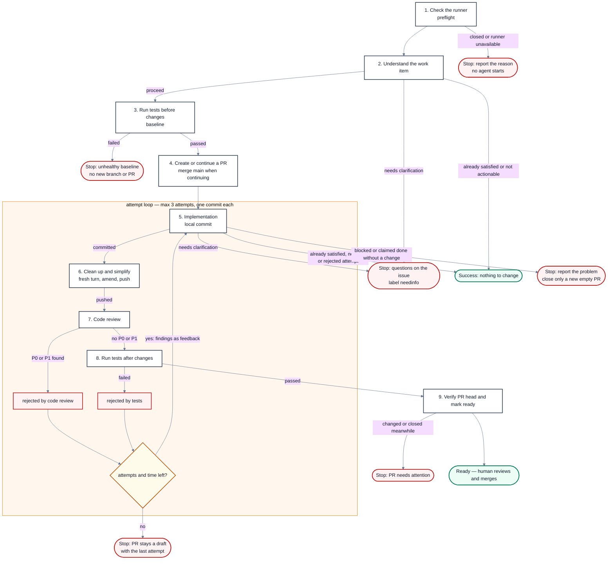

# Ship Loop

Reference for the workshop's guided software-delivery example. Other company and scenario templates use the shared, general-purpose block library and do not need this exact pipeline. The interactive board does not start here.

The workshop steps are a simplified, editable model. For example, they initially record a failing baseline and continue; the current Nikolai reference below stops on a failing baseline. Exports preserve the participant's actual board, including such choices, rather than replacing it with this reference.

An agent implements a task, cleans up, reviews, and tests in a bounded loop, then marks a pull request ready for a person to merge. This reference follows **Nikolai 32**, reviewed at commit `908bfe961` (22 September 2026) in `r7defoldclient`; its implementation is in `tools/nikolai/` and its detailed guide is `docs/development/issue-automation.md`.

## Stages

| # | Stage | What it does |
|---|-------|----------------|
| 1 | `preflight` | Check the runner, agent login, GitHub access, and open work item |
| 2 | `understand` | Read the issue or pull request, discussion, and source; plan in a read-only turn |
| 3 | `baseline` | Run tests before changes; a failure stops before a new branch or PR is created |
| 4 | `branch` | Branch and open a draft pull request, or continue an existing PR with current `main` merged in |
| 5 | `implement` | Implementation; Nikolai commits locally |
| 6 | `simplify` | Clean up and simplify; the edits are amended into the attempt's commit, then pushed |
| 7 | `review` | Fresh read-only review against the original request, discussion, and project rules; P0/P1 findings reject the attempt |
| 8 | `tests` | Run tests on the reviewed commit, including tests added or changed by the attempt |
| 9 | `ready` | Confirm the PR is still open at the reviewed commit, then mark it ready |

## Rules around the loop

- **Work items can be issues or existing pull requests.** Manual dispatch or a trusted collaborator's mention starts a run. An existing same-repository PR keeps its branch and earlier work; `main` is merged without force-pushing. A person's PR also keeps its title and description. Fork PRs are not supported by this reference implementation.
- **The request is the authority.** The plan guides the work; it does not add requirements the user never asked for. A clear task can proceed even when its category is unknown. Automation, workflow, and agent-instruction edits are valid when required by the task; review judges their effects, including any weakened checks.
- **Each attempt includes cleanup.** Implementation is committed locally, a fresh cleanup turn is amended into that commit, and the result is pushed, reviewed, and tested. Findings or failing tests feed the next attempt. The reference allows three attempts and starts no retry with less than 75 minutes left in its run budget.
- **Nothing to change is a valid success.** Planning or implementation may find the request already satisfied. Implementation cannot use that result to hide uncommitted edits or dismiss a previously rejected attempt. An empty PR created by this run is closed; an existing PR is preserved. The result does not claim a newly merged `main` has passed final verification.
- **Human input and operational failures stay distinct.** Missing requirements produce questions and `needinfo`; failed checks, exhausted attempts, or insufficient time leave the last attempt in draft with the specific problem. An agent allowance limit is reported separately. Closed work items stop before agent startup without posting a comment.
- **The controller owns Git and GitHub.** Agent turns return structured results. Only the controller commits, pushes, and updates PR status; planning and review are checked for working-tree changes. Nikolai never merges or pushes to `main`.
- **Public status stays concise.** Issues and PRs show the result, verification, and anything needing action. Only pipeline reviews with findings are posted separately. Full stage reports, attempt history, and diagnostic artifacts remain in Actions. Both ready-for-review and nothing-to-change outcomes are green.

Adapt runner requirements, agent commands, tests, time budgets, and project rules to the participant's own company, game, or product. The board's **Export loop** button exports the diagram currently on screen as an agent prompt, a GitHub Actions starter bundle, or a prompt for building those Actions. It does not contact an agent; the participant supplies the export to one. The starter requires project-specific adapters and configuration.

## Flow

