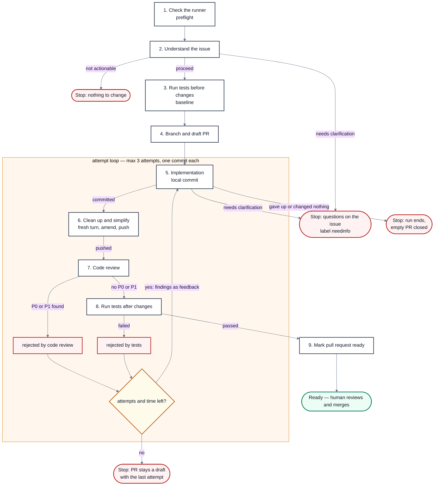

# Ship Loop

Reference for the system this workshop grows toward. The interactive board does not start here.

An agent implements a task, cleans up, reviews, and tests in a bounded loop, then marks a pull request ready for a person to merge.

## Stages

| # | Stage | What it does |
|---|-------|----------------|
| 1 | `preflight` | Check the runner |
| 2 | `understand` | Understand the issue |
| 3 | `baseline` | Run tests before changes |
| 4 | `branch` | Branch and open a draft pull request |
| 5 | `implement` | Implementation; Nikolai commits locally |
| 6 | `simplify` | Clean up and simplify; the edits are amended into the attempt's commit, then pushed |
| 7 | `review` | Code review of that commit |
| 8 | `tests` | Run tests after changes |
| 9 | `ready` | Mark the pull request ready |

## Flow

